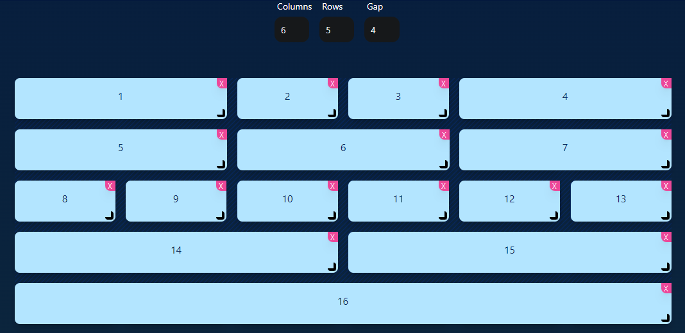

****# React + TypeScript + Vite

This template provides a minimal setup to get React working in Vite with HMR and some ESLint rules.

Currently, two official plugins are available:

- [@vitejs/plugin-react](https://github.com/vitejs/vite-plugin-react/blob/main/packages/plugin-react/README.md) uses [Babel](https://babeljs.io/) for Fast Refresh
- [@vitejs/plugin-react-swc](https://github.com/vitejs/vite-plugin-react-swc) uses [SWC](https://swc.rs/) for Fast Refresh

## Expanding the ESLint configuration

If you are developing a production application, we recommend updating the configuration to enable type aware lint rules:

- Configure the top-level `parserOptions` property like this:

```js
export default {
  // other rules...
  parserOptions: {
    ecmaVersion: 'latest',
    sourceType: 'module',
    project: ['./tsconfig.json', './tsconfig.node.json'],
    tsconfigRootDir: __dirname,
  },
}
```

- Replace `plugin:@typescript-eslint/recommended` to `plugin:@typescript-eslint/recommended-type-checked` or `plugin:@typescript-eslint/strict-type-checked`
- Optionally add `plugin:@typescript-eslint/stylistic-type-checked`
- Install [eslint-plugin-react](https://github.com/jsx-eslint/eslint-plugin-react) and add `plugin:react/recommended` & `plugin:react/jsx-runtime` to the `extends` list


## Tailwindgen
- [URL](https://www.tailwindgen.com/)



```HTML
<div className="grid grid-cols-6 grid-rows-5 gap-4">
    <div className="col-span-2">1</div>
    <div className="col-start-3">2</div>
    <div className="col-start-4">3</div>
    <div className="col-span-2 col-start-5">4</div>
    <div className="col-span-2 row-start-2">5</div>
    <div className="col-span-2 col-start-3 row-start-2">6</div>
    <div className="col-span-2 col-start-5 row-start-2">7</div>
    <div className="row-start-3">8</div>
    <div className="row-start-3">9</div>
    <div className="row-start-3">10</div>
    <div className="row-start-3">11</div>
    <div className="row-start-3">12</div>
    <div className="row-start-3">13</div>
    <div className="col-span-3">14</div>
    <div className="col-span-3 col-start-4 row-start-4">15</div>
    <div className="col-span-6 row-start-5">16</div>
</div>

```